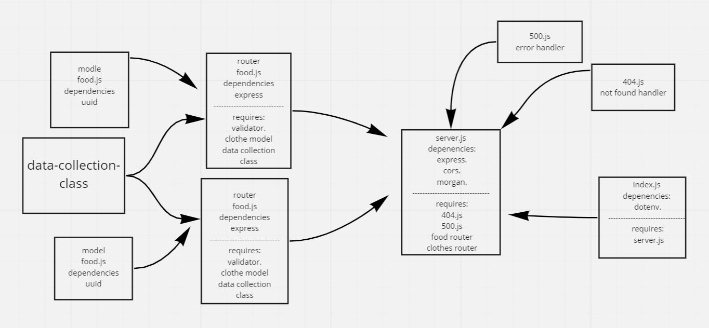

# api-server
## heroku app link:  
[https://saeed-api-server-lab4.herokuapp.com/](https://saeed-api-server-lab4.herokuapp.com/)  
## pull request link:  
[https://github.com/awwadsaeed/api-server/pull/1](https://github.com/awwadsaeed/api-server/pull/1)  
## GitHub actions link:  
[https://github.com/awwadsaeed/api-server/actions](https://github.com/awwadsaeed/api-server/actions)
## describtion  
a basic api server that has a models and data collection class.  5 requeste to each model to deomnstrate a crud app with rest methods and mimick a data base along with some middleware.
it integrated CI testing.  

## UML:  
